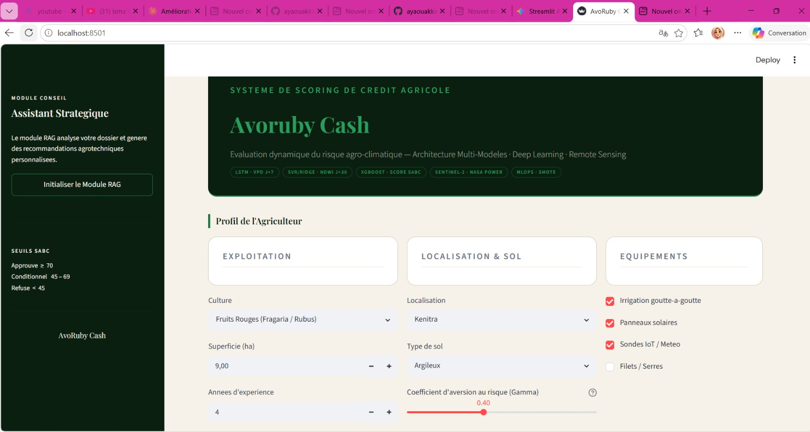
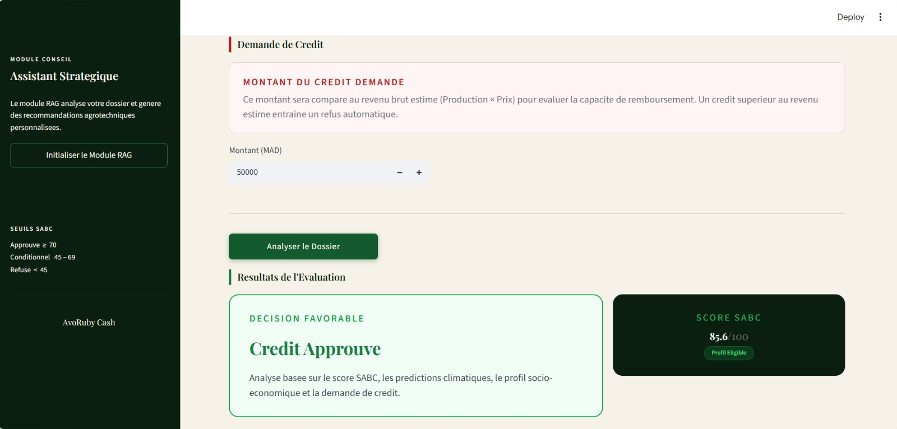
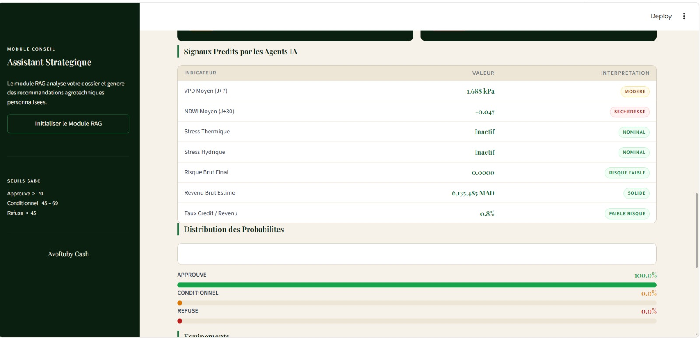
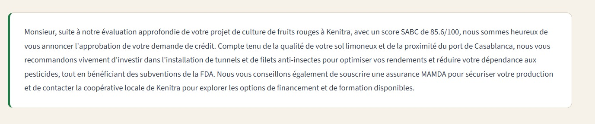

# Introduction

## AvoRuby Cash — Intelligent Agro-Climatic Credit Scoring

**AvoRuby Cash** is an end-to-end AI-powered platform for dynamic agricultural
credit evaluation, combining satellite data, deep learning time-series forecasting,
XGBoost scoring, and a RAG-based advisory engine.

Developed at **ENSAM Meknes** as a 3rd Year Applied AI Project,
the system targets the *Crédit Agricole du Maroc* (CAM) ecosystem and
Moroccan agricultural operators cultivating **avocado** and **red fruits**.

---

## Application Interface

The platform is accessible as a Streamlit web application:









> **Live Demo:** The application requires a local Ollama instance for the
> RAG advisory module.

---

## Context and Problem Statement

Moroccan agricultural banks face a structural challenge: **80% of loan applications
from small and medium farms lack the financial history** required by conventional
credit scoring. The result is either systematic rejection of viable projects or
approval of high-risk portfolios.

AvoRuby Cash addresses this gap by reconstructing creditworthiness from
**agronomic and climatic signals** — a paradigm shift from financial-based
scoring to **agro-climatic scoring**.

---

## Scientific Objectives

### VPD — Vapor Pressure Deficit

Measures atmospheric dryness driving plant water stress:

```
VPD (kPa) = es(T) - ea
es(T) = 0.6108 × exp(17.27T / (T + 237.3))
```

| VPD Range | Interpretation |
|---|---|
| < 0.8 kPa | Optimal — no stress |
| 0.8 – 1.5 kPa | Mild transpiration |
| 1.5 – 2.5 kPa | Moderate stress |
| > 2.5 kPa | Severe stress — yield loss |

### NDWI — Normalized Difference Water Index

Satellite-derived vegetation water content (Sentinel-2):

```
NDWI = (Band8 - Band11) / (Band8 + Band11)
```

| NDWI Value | Interpretation |
|---|---|
| > 0.2 | Good hydration |
| 0 – 0.2 | Moderate stress |
| < 0 | Severe water stress |

### SABC Score

Internal composite creditworthiness index on a 0–88 scale
incorporating agronomic, climatic, financial and equipment factors.

| Score | Decision |
|---|---|
| 75 – 88 | APPROUVE |
| 55 – 74 | CONDITIONNEL |
| < 55 | REFUSE |

---

## System Architecture

```
+----------------------------------------------------------+
|               AvoRuby Cash — Streamlit App               |
+-------------------------+--------------------------------+
                          | Farmer profile inputs
                          v
+----------------------------------------------------------+
|              models.py — Inference Pipeline              |
|                                                          |
|  LSTM (VPD) → SARIMA (NDWI) → XGB Price → XGB Yield    |
|                          |                               |
|              XGBoost Credit v6 (44 features)             |
|              SMOTE-NC rebalanced                         |
+-------------------------+--------------------------------+
                          |
        +-----------------+------------------+
        v                 v                  v
  Credit Amount     Results Display      RAG Advisory
  Adjustment        Streamlit UI         gemma:4b +
  (DCR, RCR)                             ChromaDB +
                                         LangChain
```

---

## Pipeline Overview

| Layer | Model | Output |
|---|---|---|
| Climate | LSTM PyTorch | VPD forecast (R²=0.94) |
| Satellite | SARIMA | NDWI index (MAE=0.014) |
| Market | XGBoost | Price MAD/kg (R²=0.73) |
| Agronomic | XGBoost | Yield kg/ha (R²=0.57) |
| Credit | XGBoost v6 | APPROUVE / CONDITIONNEL / REFUSE (Acc=0.983) |
| Advisory | RAG gemma:4b | Personalized recommendations |