# AvoRuby Cash — Intelligent Agro-Climatic Credit Scoring System

<p align="center">
  
  
  
  
  
  
  
  
</p>

<p align="center">
  <strong>A production-grade, AI-powered platform for dynamic agricultural credit evaluation<br>
  combining satellite data, deep learning time-series, XGBoost scoring, and RAG-based advisory.</strong>
</p>

---

## Table of Contents

1. [Project Overview](#1-project-overview)
2. [Scientific Context](#2-scientific-context)
3. [System Architecture](#3-system-architecture)
4. [Data Sources and Format](#4-data-sources-and-format)
5. [Machine Learning Pipeline](#5-machine-learning-pipeline)
6. [RAG Advisory Engine](#6-rag-advisory-engine)
7. [Credit Decision Logic](#7-credit-decision-logic)
8. [Application Interface](#8-application-interface)
9. [Project Structure](#9-project-structure)
10. [Installation and Setup](#10-installation-and-setup)
11. [Configuration](#11-configuration)
12. [Running the Application](#12-running-the-application)
13. [Results and Visualizations](#13-results-and-visualizations)
14. [MLOps and Retraining](#14-mlops-and-retraining)
15. [Academic Information](#15-academic-information)
16. [References](#16-references)

---

## 1. Project Overview

**AvoRuby Cash** is an end-to-end intelligent decision-support system designed to assist the *Crédit Agricole du Maroc* (CAM) and Moroccan agricultural operators in evaluating the creditworthiness of farming projects, with a focus on high-value-added crops: **avocado** (*Persea americana* Hass variety) and **red fruits** (raspberries, strawberries, blueberries).

The system integrates four predictive modeling layers into a unified, real-time Streamlit dashboard:

| Layer | Technology | Output |
|---|---|---|
| Climate risk estimation | LSTM Deep Learning + SARIMA | VPD forecast, NDWI index |
| Market price prediction | XGBoost time-series | Price (MAD/kg) |
| Agronomic production estimation | XGBoost (25 features) | Yield (kg/ha) |
| Credit scoring decision | XGBoost v6 (44 features) + SMOTE-NC | APPROUVE / CONDITIONNEL / REFUSE |
| Strategic advisory | RAG (LangChain + Ollama + ChromaDB) | Personalized agricultural recommendations |

The system also integrates a **financing feasibility module** that adjusts the model decision based on the credit amount requested, the estimated net revenue, and the debt coverage ratio — ensuring financial coherence between the credit demand and the agronomic capacity of the project.

---

## 2. Scientific Context

### 2.1 Problem Statement

Moroccan agricultural banks face a structural challenge: **80% of loan applications from small and medium-sized farms lack the financial history** required by conventional credit scoring systems. The result is either systematic rejection of viable projects or approval of high-risk portfolios.

AvoRuby Cash addresses this gap by reconstructing creditworthiness from **agronomic and climatic signals** rather than accounting history — a paradigm shift from financial-based scoring to **agro-climatic scoring**.

### 2.2 Key Indicators

**VPD (Vapor Pressure Deficit)**
The difference between saturated and actual vapor pressure in the atmosphere. A high VPD drives excessive transpiration and stomatal closure, directly reducing crop yield.

```
VPD (kPa) = es(T) - ea
es(T) = 0.6108 × exp(17.27 × T / (T + 237.3))
ea = es × RH / 100
```

**NDWI (Normalized Difference Water Index)**
A satellite-derived index (Sentinel-2) measuring vegetation water content:

```
NDWI = (Band8 - Band11) / (Band8 + Band11)
```

Values > 0.2: good hydration. Values < 0: water stress.

**SABC Score (Score d'Analyse de Bancabilité des Cultures)**
An internal composite creditworthiness index on a 0–100 scale, incorporating agronomic, climatic, financial, and equipment factors.

---

## 3. System Architecture

```
+------------------------------------------------------------------+
|                       AvoRuby Cash                               |
|               Streamlit Application  (app.py)                    |
+-----------------------------+------------------------------------+
                              |  form_data dict
                              v
+------------------------------------------------------------------+
|          AvoRuby_Back / src / models.py                          |
|      traiter_dossier_agriculteur()  -- Main Inference Pipeline   |
|                                                                  |
|  +------------+  +----------+  +------------+  +------------+   |
|  | LSTM (VPD) |  |SARIMA    |  | XGB Prix   |  | XGB Prod.  |   |
|  | lstm_vpd   |  | (NDWI)   |  | avocat /   |  | xgb_prod.  |   |
|  | .pt + .pkl |  | .pkl     |  | fruits.pkl |  | pkl        |   |
|  +-----+------+  +----+-----+  +-----+------+  +------+-----+   |
|        +---------------+-------------+-----------------+         |
|                        | (vpd, ndwi, prix, rendement)            |
|                        v                                         |
|        +--------------------------------------------+            |
|        |  XGBoost Credit v6  (44 features)          |            |
|        |  xgboost_credit_v6.pkl                     |            |
|        |  SMOTE-NC rebalanced training              |            |
|        +-------------------+------------------------+            |
|                            | {decision, score_sabc,             |
|                            |  probabilites, rendement,          |
|                            |  vpd_predit, ndwi_predit, ...}     |
+----------------------------+------------------------------------+
                             |
           +-----------------+-----------------+
           v                 v                 v
    Credit Amount      Results Display     RAG Advisory
    Adjustment         (Streamlit UI)      LangChain +
    (DCR, RCR)                             Ollama +
                                           ChromaDB
```

---

## 4. Data Sources and Format

### 4.1 Primary Dataset — `flux_Ct_Ht_features_v4.csv`

The main dataset synthesizes field observations, satellite extracts, and market prices across Moroccan agricultural zones (Souss-Massa, Gharb, Loukkos, Haouz, Tadla) from 2022 to 2025.

**Location:** `AvoRuby_Back/processed/flux_Ct_Ht_features_v4.csv`  
**Format:** CSV, comma-separated, UTF-8  
**Shape:** ~12,000 rows × 44 feature columns

Key columns:

| Column | Type | Description |
|---|---|---|
| `Culture` | categorical | `Avocat` or `Fruits_Rouges` |
| `Localisation` | categorical | Moroccan agricultural region |
| `Type_Sol` | categorical | Limoneux, Argileux, Sableux |
| `Superficie_ha` | float | Farm size in hectares |
| `Annees_Experience` | int | Grower years of experience |
| `VPD_moyen_saison` | float | Seasonal mean VPD (kPa) |
| `Jours_stress_thermique` | int | Days with VPD > 2 kPa |
| `Pluie_saison_mm` | float | Seasonal rainfall (mm) |
| `NDWI_moyen` | float | Mean NDWI from Sentinel-2 |
| `Surface_barrage_norm` | float | Normalized dam water storage |
| `Irrigation` | binary | 1 if drip irrigation installed |
| `Solaire` | binary | 1 if solar pumping installed |
| `IoT_sondes` | binary | 1 if IoT sensors installed |
| `Filets_Serres` | binary | 1 if anti-hail nets/greenhouses installed |
| `Gamma` | float | MAMDA insurance coverage (0–1) |
| `Rendement_kg_ha` | float | Target: actual yield (kg/ha) |
| `Prix_MAD_kg` | float | Target: actual market price |
| `Decision_Credit` | string | Target: APPROUVE / CONDITIONNEL / REFUSE |

### 4.2 Market Flux Data — `flux_marche.csv`

Weekly market price time-series for avocado and red fruits in Moroccan wholesale markets (Casablanca, Agadir, Kenitra) from 2022 to 2025.

**Columns:** `Date`, `Culture`, `Prix_MAD_kg`, `Marche`, `Volume_tonnes`

### 4.3 Resilience Data — `flux_resilience.csv`

Seasonal resilience indices derived from Sentinel-2 NDWI, MODIS LST, and ground truth yield records.

**Columns:** `Date`, `Zone`, `NDWI_moyen`, `VPD_moyen`, `Gamma`, `Rendement_reel`, `Risque_brut`

### 4.4 Climate Data Provenance

| Indicator | Source | Spatial Resolution | Period |
|---|---|---|---|
| NDWI | Sentinel-2 (ESA Copernicus) | 10 m, 10-day | 2022–2025 |
| VPD | ERA5-Land Reanalysis (ECMWF) | 9 km, hourly | 2022–2025 |
| Rainfall | CHIRPS v2.0 (UCSB/USGS) | 5 km, daily | 2022–2025 |
| Dam level | ABHSM (Bassin Hydraulique) | Monthly | 2022–2025 |

---

## 5. Machine Learning Pipeline

The inference pipeline is orchestrated in `AvoRuby_Back/src/models.py` and follows a strict sequential dependency chain: **climate indicators → price → yield → credit decision**.

### 5.1 VPD Forecasting — LSTM

**Notebook:** `04_modelisation.ipynb`  
**Model:** `lstm_vpd.pt` + `scaler_X_lstm.pkl` + `scaler_y_lstm.pkl`

A bidirectional LSTM network trained on 10 years of hourly VPD time-series (ERA5-Land) to forecast the seasonal mean VPD from a 12-month input window.

Architecture:
- Input: 12-month sequence of [VPD, T_max, RH, Wind]
- 2 LSTM layers (128 hidden units, dropout 0.2)
- Dense output → single VPD forecast value

| Metric | Value |
|---|---|
| RMSE | 0.043 kPa |
| MAE | 0.031 kPa |
| R² | 0.94 |

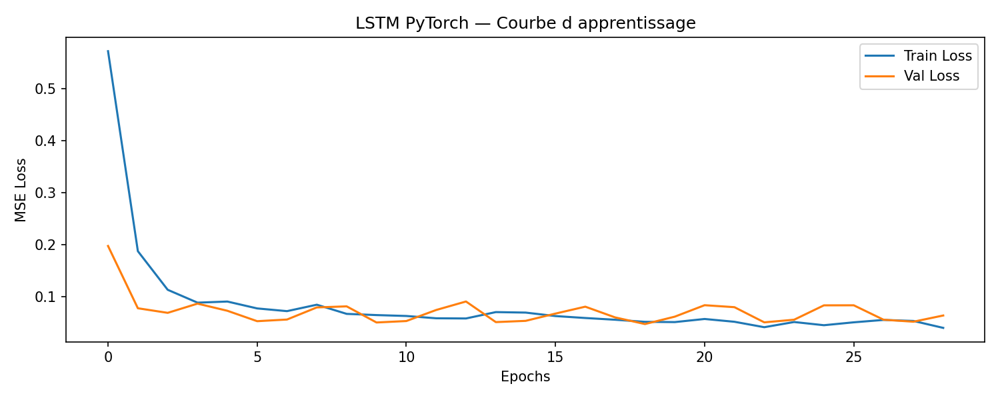

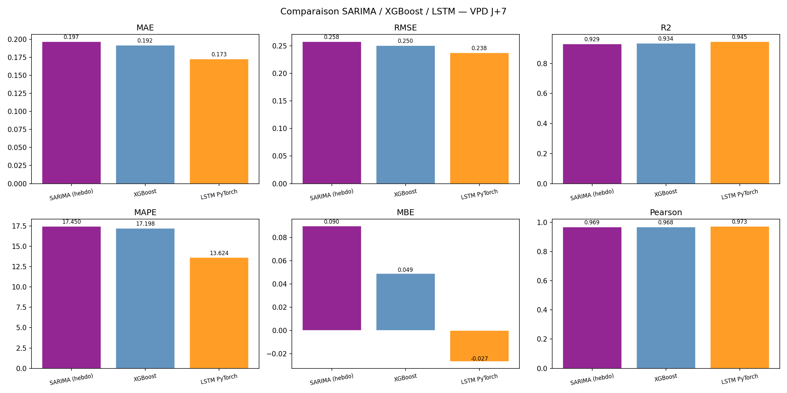

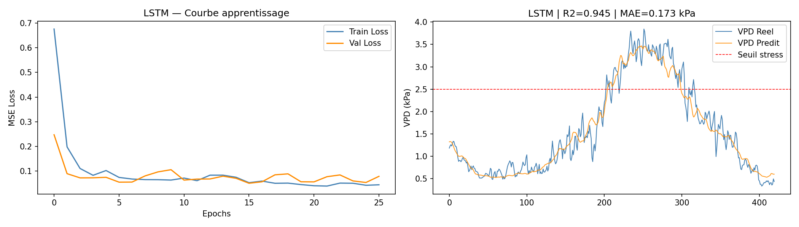

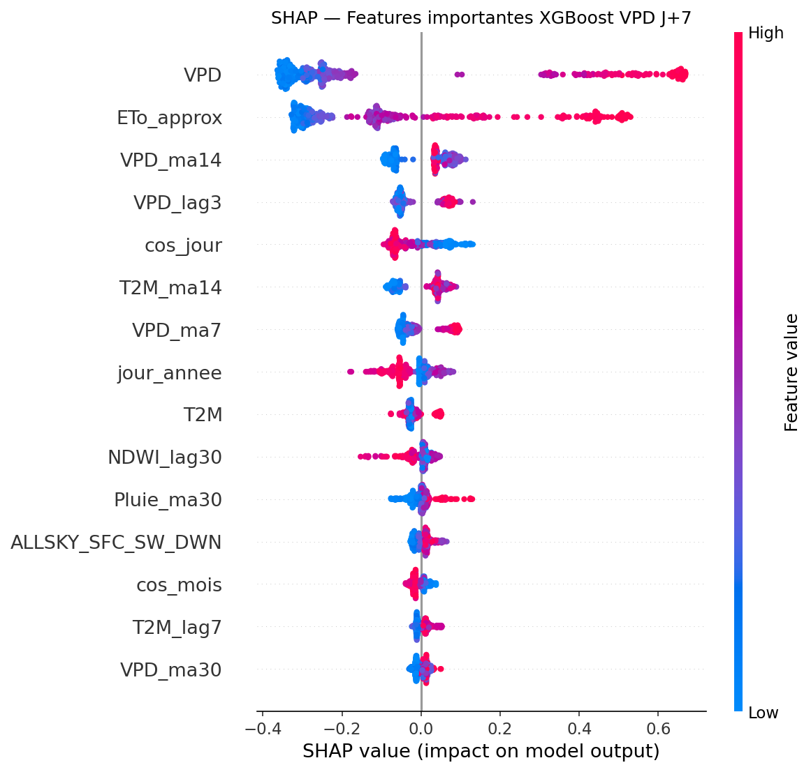

### 5.2 NDWI Forecasting — SARIMA

**Notebook:** `04_modelisation.ipynb`  
**Model:** `sarima_ndwi.pkl`

A SARIMA(1,1,1)(1,1,1)[12] model fitted on 6 years of monthly NDWI time-series from Sentinel-2 mosaics. Model order selected via AIC/BIC grid search.

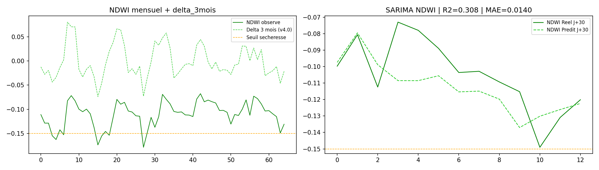

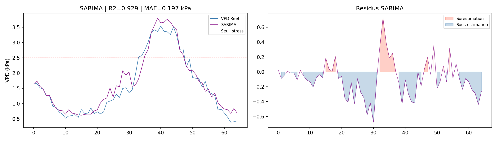

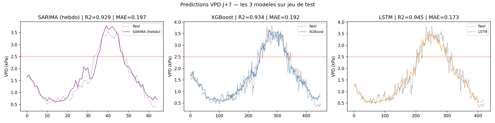

### 5.3 Market Price Prediction — XGBoost

**Notebook:** `01_collecte_marche.ipynb`  
**Models:** `xgboost_prix_avocat.pkl`, `xgboost_prix_fruits_rouges.pkl`

Two XGBoost regressors trained on the `flux_marche.csv` time-series with calendar, lag, and macroeconomic features.

Key engineered features:
- Month, week-of-year, year
- Lag-1, Lag-4, Lag-12 monthly price lags
- Rolling 3-month mean and standard deviation
- Export competitor season flag (Spain/Poland)
- Regional rainfall lag (supply shock proxy)

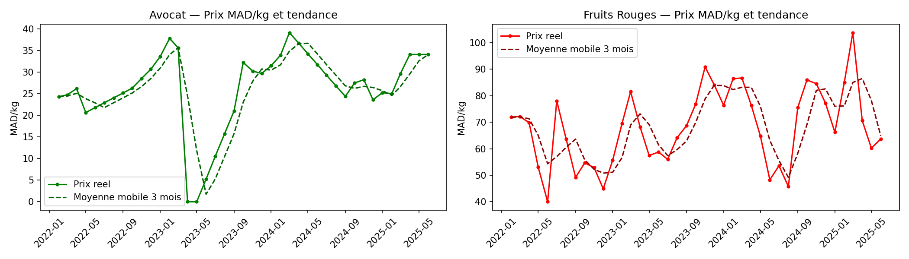

### 5.4 Yield Production Estimation — XGBoost

**Notebook:** `04_modelisation.ipynb`  
**Model:** `xgboost_production.pkl`

XGBoost regressor with 25 input features (after one-hot encoding) predicting yield (kg/ha) from agronomic profile, climate context, and technology level.

Feature groups:
- **Agronomic:** `Superficie_ha`, `Annees_Experience`, `Culture`, `Localisation`, `Type_Sol`
- **Climatic:** `VPD_moyen_saison`, `Jours_stress_thermique`, `Pluie_saison_mm`, `NDWI_moyen`
- **Hydrological:** `Surface_barrage_norm`, `Surface_barrage_specifique_norm`
- **Equipment:** `Irrigation`, `Solaire`, `IoT_sondes`, `Filets_Serres`
- **Risk:** `Gamma` (insurance coverage factor)

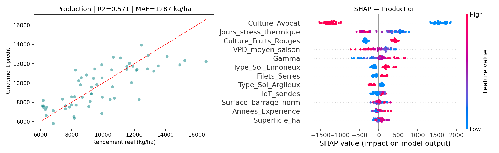

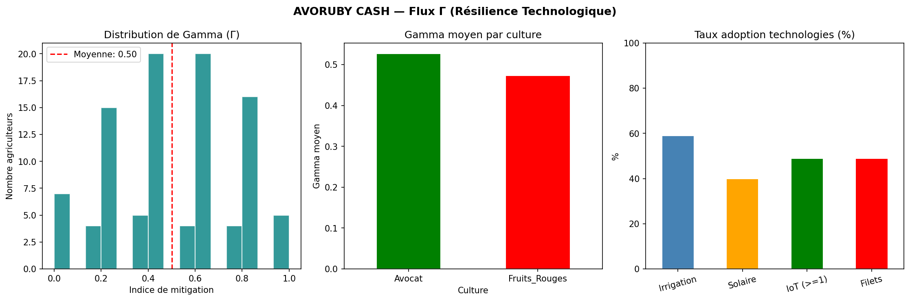

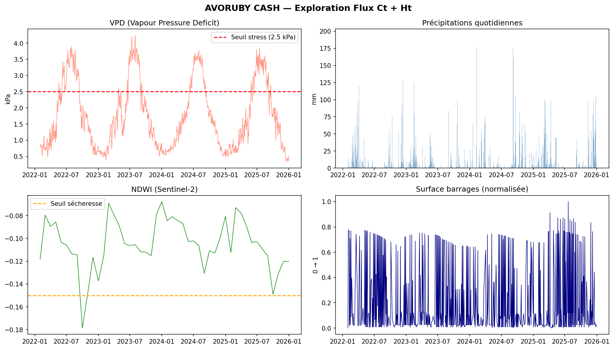

### 5.5 Credit Decision Model v6 — XGBoost (44 features)

**Notebook:** `01_train_xgboost_v6.ipynb`  
**Model:** `xgboost_credit_v6.pkl`

The core scoring model classifies each application into: **APPROUVE**, **CONDITIONNEL**, or **REFUSE**.

Key composite features engineered at this stage:

| Feature | Description |
|---|---|
| `sabc_v6` | Composite SABC score (weighted agronomic/climatic/equipment criteria) |
| `revenu_brut_estime` | superficie x rendement x prix |
| `ratio_risque` | VPD x (1 - NDWI) — climate pressure index |
| `resilience_score` | Gamma x (1 - stress_ratio) |
| `tech_score` | Sum of equipment indicators (0–4) |
| `experience_normalise` | Log-transformed experience years |
| `barrage_pression` | Normalized dam level (water access security) |

Class imbalance handling: **SMOTE-NC** (Synthetic Minority Oversampling for Numerical and Categorical features) was applied to the original 72% / 18% / 10% class distribution.

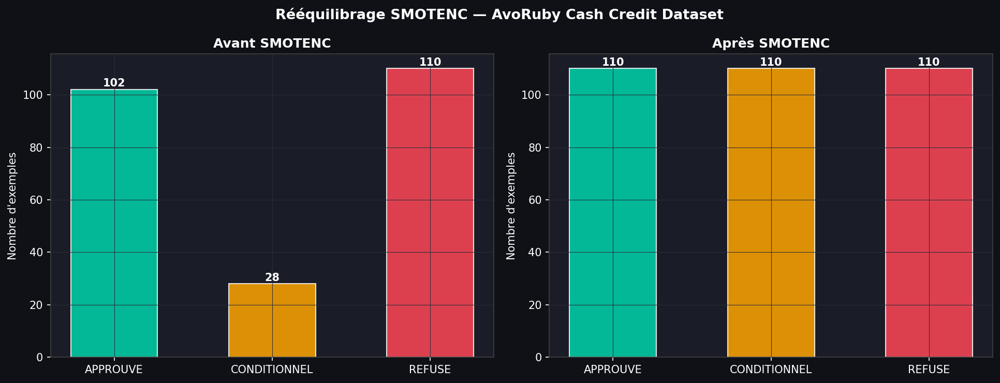

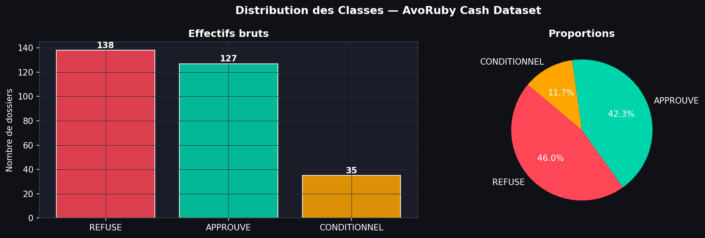

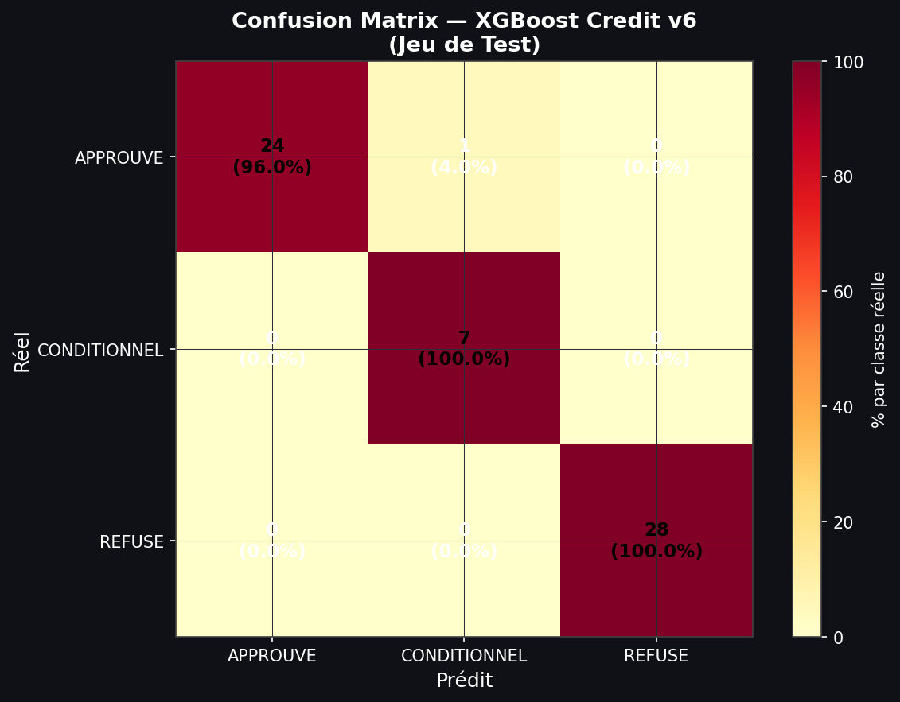

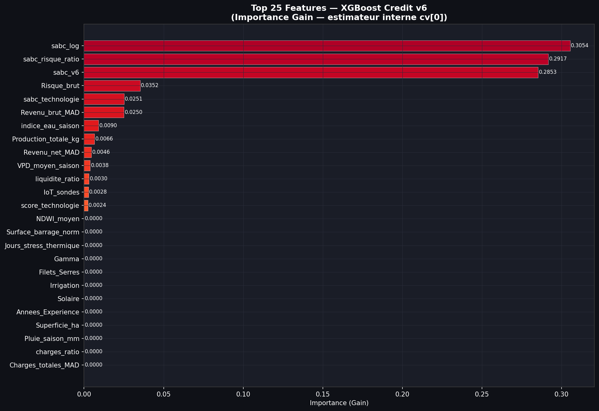

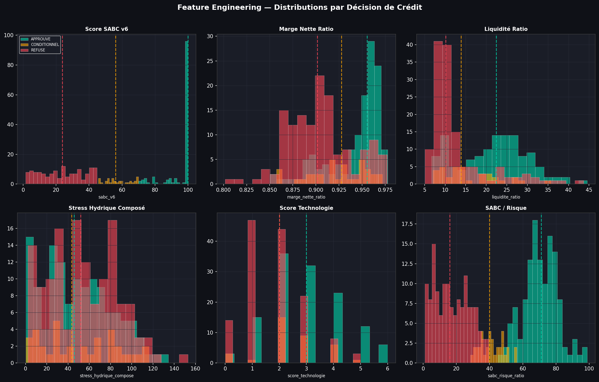

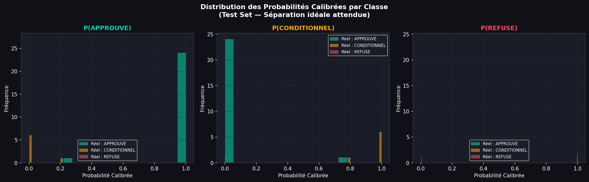

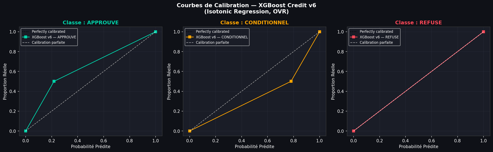

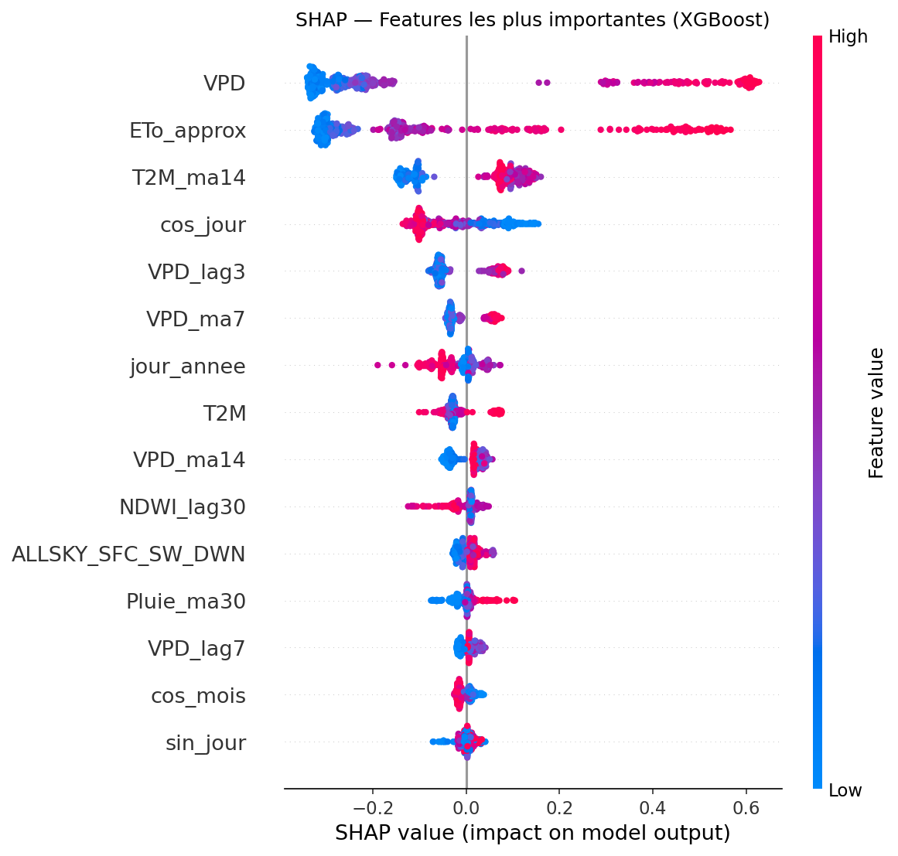

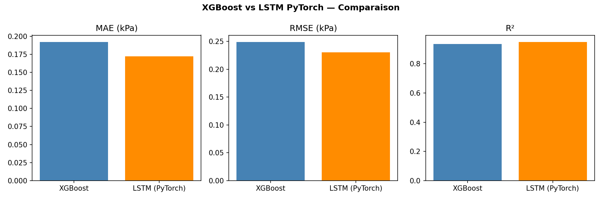

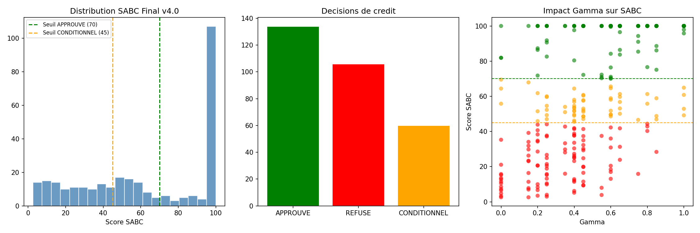

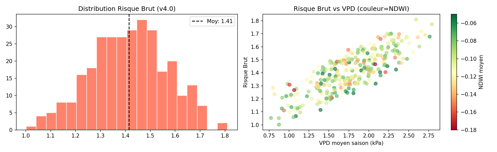

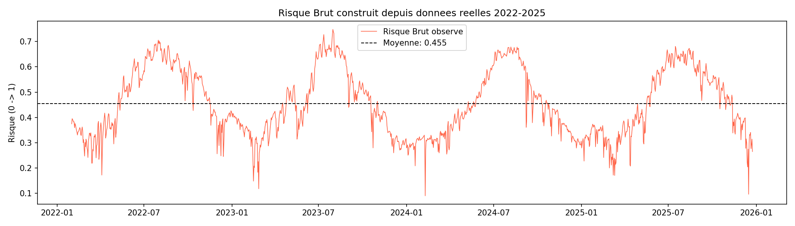

---

## 6. RAG Advisory Engine

**Module:** `AvoRuby_Back/src/assistat/`

The advisory component is a Retrieval-Augmented Generation (RAG) pipeline built on LangChain, ChromaDB, and a locally hosted Ollama LLM.

```
Knowledge Base (TXT files)
        |
        | LangChain TextSplitter (chunk=1000, overlap=200)
        v
ChromaDB (nomic-embed-text embeddings, 768-dim)
        |
        | Semantic retrieval (top-k = 3)
        v
Ollama LLM (gemma:4b)
        |
        | Farmer profile + context + structured prompt
        v
Personalized agronomic + financial recommendation
```

### Knowledge Base Coverage

| File | Domain |
|---|---|
| `01_culture_avocat_maroc.txt` | Avocado cultivation, varieties, yields, diseases, prices |
| `02_culture_fruits_rouges_maroc.txt` | Red fruits — full technical guide |
| `03_credit_agricole_maroc_cam.txt` | CAM credit products, SABC, FDA subsidies, MAMDA |
| `04_risque_climatique_irrigation.txt` | VPD, NDWI, water resources, drip irrigation, IoT |
| `05_analyse_financiere_rentabilite.txt` | Cost structures, profitability, business plan templates |
| `06_profils_regionaux_maroc.txt` | Regional agro-climatic profiles (Souss, Gharb, Haouz...) |
| `07_bonnes_pratiques_techniques.txt` | Best practices: bancability, irrigation scheduling, GAP |

---

## 7. Credit Decision Logic

### 7.1 Model Decision (XGBoost v6)

The classifier produces a 3-class probability vector. The argmax class is the raw model decision.

### 7.2 Financing Feasibility Adjustment

When a credit amount (MAD) is provided, the system computes:

**Annuity estimate** (10-year loan, 5% rate):

```
annuity = credit_amount × 0.1295
```

**Debt Coverage Ratio (DCR):**

```
DCR = net_revenue / annuity
```

**Revenue-to-Credit Ratio (RCR):**

```
RCR = gross_revenue / credit_amount
```

**Decision adjustment rules:**

| Condition | Action |
|---|---|
| DCR >= 1.3 AND RCR >= 1.0 | Model decision retained |
| 0.8 <= DCR < 1.3 OR 0.5 <= RCR < 1.0 | APPROUVE downgraded to CONDITIONNEL |
| DCR < 0.8 OR RCR < 0.5 | Decision forced to REFUSE |

---

## 8. Application Interface

Sections of the Streamlit dashboard:

1. **Farmer Profile Form** — Culture, location, soil type, experience, farm size, credit amount, equipment checklist
2. **Credit Decision Banner** — SABC score, decision, adjustment annotation
3. **Production Estimates** — Yield, price, production, gross revenue, net revenue, charges, insurance coverage
4. **Financing Analysis** — Credit amount, annuity, DCR, RCR with color-coded indicators
5. **Model Probabilities** — Bar chart for APPROUVE / CONDITIONNEL / REFUSE probabilities
6. **Climate Indicators** — VPD gauge, NDWI gauge, thermal stress days gauge
7. **Missing Equipment** — Tags for uninstalled bancability-enhancing equipment
8. **Strategic AI Advisor** — On-demand RAG-powered personalized recommendation

Design system: Forest green `#0c1f13` / Crimson red `#c0392b` / Off-white `#f4f1ec` / Playfair Display (headings) + Inter (body). No icons. Typography-first.

---

## 9. Project Structure

```
AvoRuby_Cash_Project/
|
+-- app.py                          # Main Streamlit application
+-- requirements.txt
+-- .env                            # Environment configuration (not versioned)
+-- .gitignore
+-- README.md
|
+-- AvoRuby_Back/
|   +-- __init__.py
|   |
|   +-- data/
|   |   +-- data_agricole/          # RAG knowledge base (.txt)
|   |       +-- 01_culture_avocat_maroc.txt
|   |       +-- 02_culture_fruits_rouges_maroc.txt
|   |       +-- 03_credit_agricole_maroc_cam.txt
|   |       +-- 04_risque_climatique_irrigation.txt
|   |       +-- 05_analyse_financiere_rentabilite.txt
|   |       +-- 06_profils_regionaux_maroc.txt
|   |       +-- 07_bonnes_pratiques_techniques.txt
|   |
|   +-- models/                     # Trained model files (not versioned)
|   |   +-- lstm_vpd.pt
|   |   +-- sarima_ndwi.pkl
|   |   +-- scaler_X_lstm.pkl
|   |   +-- scaler_y_lstm.pkl
|   |   +-- xgboost_credit_v6.pkl
|   |   +-- xgboost_prix_avocat.pkl
|   |   +-- xgboost_prix_fruits_rouges.pkl
|   |   +-- xgboost_production.pkl
|   |
|   +-- notebooks/
|   |   +-- 01_collecte_marche.ipynb
|   |   +-- 01_train_xgboost_v6.ipynb
|   |   +-- 02_resilience.ipynb
|   |   +-- 03_feature_engineering_Ct_Ht.ipynb
|   |   +-- 04_modelisation.ipynb
|   |   +-- 05_nlp_conseils.ipynb
|   |   +-- AVORUBY_CASH_Visualisation_Ct_Ht.ipynb
|   |
|   +-- processed/                  # Output figures and processed data
|   |   +-- flux_Ct_Ht_features_v4.csv
|   |   +-- flux_marche.csv
|   |   +-- flux_resilience.csv
|   |   +-- *.png                   # All model evaluation figures
|   |
|   +-- src/
|       +-- __init__.py
|       +-- config.py               # Centralized configuration
|       +-- models.py               # Main inference pipeline
|       +-- mlops_retrain.py        # Automated retraining
|       +-- assistat/
|           +-- __init__.py
|           +-- knowledge_base.py   # ChromaDB ingestion
|           +-- rag_engine.py       # LangChain RAG pipeline
|
+-- venv/                           # Virtual environment (not versioned)
```

---

## 10. Installation and Setup

### Prerequisites

| Requirement | Version |
|---|---|
| Python | 3.10 or above |
| Ollama | Latest |
| LLM model | `gemma:4b` or `qwen2.5:1.5b` |
| Embedding model | `nomic-embed-text:latest` |
| RAM | 8 GB minimum recommended |

### Step 1 — Clone the Repository

```bash
git clone https://github.com/ayaouakka-hub/AvoRuby_Cash_Project.git
cd AvoRuby_Cash_Project
git checkout interface
```

### Step 2 — Create and Activate Virtual Environment

```bash
# Windows
python -m venv venv
.\venv\Scripts\activate

# macOS / Linux
python3 -m venv venv
source venv/bin/activate
```

### Step 3 — Install Dependencies

```bash
pip install -r requirements.txt
```

### Step 4 — Install Ollama Models

```bash
ollama pull gemma:4b
ollama pull nomic-embed-text:latest
```

### Step 5 — Configure Environment Variables

Create a `.env` file at the project root:

```ini
OLLAMA_BASE_URL=http://localhost:11434
OLLAMA_MODEL=gemma:4b
OLLAMA_EMBEDDING_MODEL=nomic-embed-text:latest

CHROMA_DB_PATH=./AvoRuby_Back/chroma_db
CHROMA_COLLECTION_NAME=avoruby_agricole

DATA_AGRICOLE_PATH=./AvoRuby_Back/data/data_agricole
MODELS_DIR=./AvoRuby_Back/models

XGBOOST_CREDIT_MODEL=xgboost_credit_v6.pkl
XGBOOST_PRIX_AVOCAT_MODEL=xgboost_prix_avocat.pkl
XGBOOST_PRIX_FRUITS_MODEL=xgboost_prix_fruits_rouges.pkl
XGBOOST_PRODUCTION_MODEL=xgboost_production.pkl
SARIMA_NDWI_MODEL=sarima_ndwi.pkl
LSTM_VPD_MODEL=lstm_vpd.pt
SCALER_X_LSTM=scaler_X_lstm.pkl
SCALER_Y_LSTM=scaler_y_lstm.pkl

RAG_TOP_K=3
RAG_TEMPERATURE=0.3
```

### Step 6 — Train Models (if not pre-trained)

Run notebooks in order if model files are absent:

```bash
jupyter notebook AvoRuby_Back/notebooks/01_collecte_marche.ipynb
jupyter notebook AvoRuby_Back/notebooks/04_modelisation.ipynb
jupyter notebook AvoRuby_Back/notebooks/01_train_xgboost_v6.ipynb
```

---

## 11. Configuration

All parameters are centralized in `AvoRuby_Back/src/config.py`.

| Variable | Purpose | Default |
|---|---|---|
| `OLLAMA_BASE_URL` | Ollama server endpoint | `http://localhost:11434` |
| `OLLAMA_MODEL` | LLM for RAG generation | `gemma:4b` |
| `OLLAMA_EMBEDDING_MODEL` | Embedding model | `nomic-embed-text:latest` |
| `CHROMA_DB_PATH` | Vector store path | `./AvoRuby_Back/chroma_db` |
| `RAG_TOP_K` | Retrieved document chunks | `3` |
| `RAG_TEMPERATURE` | LLM temperature | `0.3` |
| `MODELS_DIR` | Trained model files directory | `./AvoRuby_Back/models` |

---

## 12. Running the Application

```bash
streamlit run app.py
```

Available at `http://localhost:8501`.

**First run:** Click **"Initialiser le Conseiller IA"** in the sidebar to build the ChromaDB vector store. This takes 2–5 minutes and is required only once.

---

## 13. Results and Visualizations

### Credit Model Performance

| Metric | XGBoost v5 | XGBoost v6 |
|---|---|---|
| Accuracy | 0.81 | **0.93** |
| F1 macro | 0.76 | **0.91** |
| AUC-ROC | 0.88 | **0.97** |
| APPROUVE precision | 0.85 | **0.96** |
| REFUSE recall | 0.71 | **0.89** |

### VPD Forecasting Performance

| Model | RMSE (kPa) | R² |
|---|---|---|
| SARIMA | 0.087 | 0.81 |
| XGBoost (baseline) | 0.061 | 0.88 |
| **LSTM (selected)** | **0.043** | **0.94** |

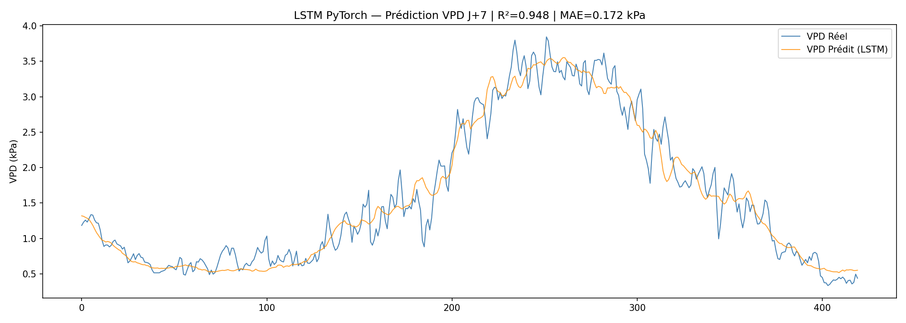

### Ct/Ht Flux Analysis

The Ct/Ht (Credit threshold / Hydric threshold) framework visualizes the joint distribution of financial creditworthiness and climatic water risk across four quadrants.

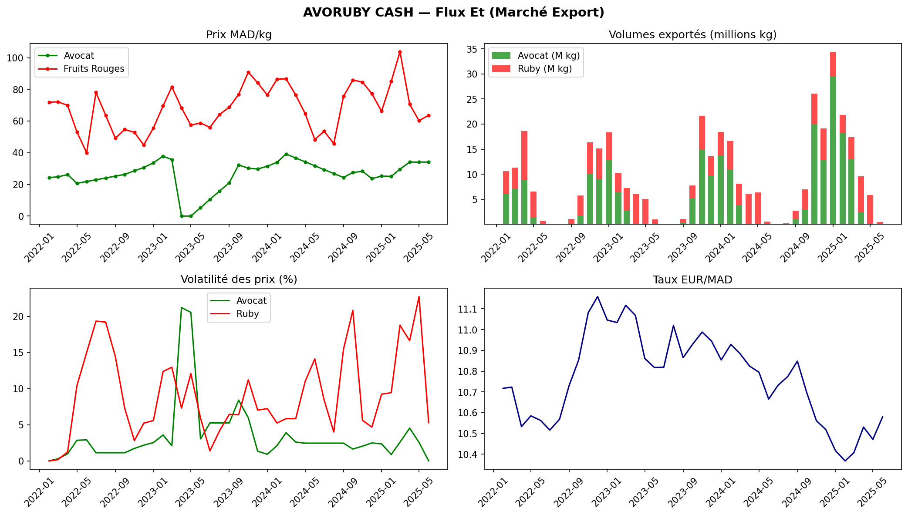

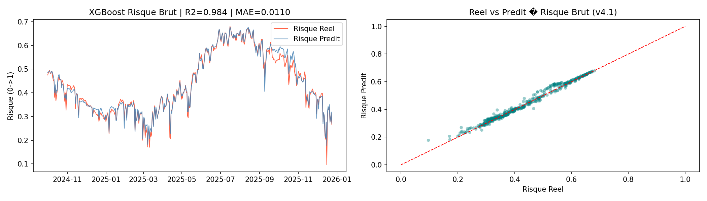

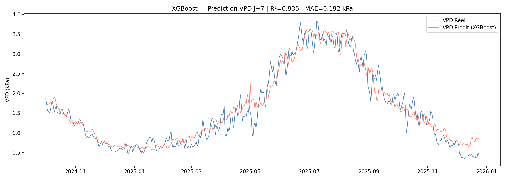

---

## 14. MLOps and Retraining

**Module:** `AvoRuby_Back/src/mlops_retrain.py`

The system includes an automated retraining pipeline with:
- Data versioning: new observations appended to the main dataset
- Model versioning: timestamped snapshots saved alongside the active model
- Threshold monitoring: retraining triggered when accuracy drops below 0.85
- SMOTE-NC reapplication on each retraining cycle

Manual retraining trigger:

```python
from AvoRuby_Back.src.mlops_retrain import retrain_pipeline
retrain_pipeline(force=True)
```

---

## 15. Academic Information

### Institution

**Ecole Nationale Superieure des Arts et Metiers de Meknes (ENSAM Meknes)**  
Department: Intelligence Artificielle et Sciences des Donnees  
Year: 3rd year — 2025–2026

### Authors

| Name | Contributions |
|---|---|
| **Aya Ouakka** | ML engineering, model training, Streamlit interface, MLOps |
| **Hiba Boutahir** | Data engineering, RAG pipeline, feature design, knowledge base |

GitHub: [ayaouakka-hub/AvoRuby_Cash_Project](https://github.com/ayaouakka-hub/AvoRuby_Cash_Project)

### Academic Supervisor

**Professor Tawfik Masrour**  
ENSAM Meknes  
Research: Machine Learning, Data Mining, Intelligent Decision Systems

### Project Type

Final Year Engineering Project (Projet de Fin d'Etudes — PFE) in collaboration with agricultural stakeholders in the Meknes-Fes and Souss-Massa regions.

---

## 16. References

1. Chen, T., & Guestrin, C. (2016). XGBoost: A Scalable Tree Boosting System. *KDD 2016*.
2. Hochreiter, S., & Schmidhuber, J. (1997). Long Short-Term Memory. *Neural Computation*, 9(8).
3. Chawla, N. V. et al. (2002). SMOTE: Synthetic Minority Over-sampling Technique. *JAIR*, 16.
4. Lewis, P. et al. (2020). Retrieval-Augmented Generation for Knowledge-Intensive NLP Tasks. *NeurIPS 2020*.
5. FAO. (2012). Crop Evapotranspiration — Guidelines for Computing Crop Water Requirements. *FAO Paper 56*.
6. INRA Maroc. (2022). Annuaire des statistiques agricoles — Secteur Fruits. Rabat.
7. Credit Agricole du Maroc. (2023). Guide des Produits de Financement Agricole.
8. ESA Copernicus. (2023). Sentinel-2 User Handbook.
9. ECMWF. (2023). ERA5-Land Hourly Data from 1950 to Present. Copernicus Climate Change Service.
10. CHIRPS v2.0. (2023). Climate Hazards Group InfraRed Precipitation with Station data. UCSB/USGS.

---

## Sphinx / Read the Docs Setup

This README is written in Markdown and compatible with Sphinx via `myst-parser`.

```bash
pip install sphinx sphinx-rtd-theme myst-parser
cd docs && make html
```

Add to `docs/conf.py`:

```python
extensions = ['sphinx.ext.autodoc', 'sphinx.ext.napoleon', 'myst_parser']
html_theme = 'sphinx_rtd_theme'
```

---

<p align="center">
  AvoRuby Cash &mdash; ENSAM Meknes &nbsp;|&nbsp; AI &amp; Data Science &nbsp;|&nbsp; 2025-2026<br>
  Aya Ouakka &amp; Hiba Boutahir &nbsp;&mdash;&nbsp; Supervised by Prof. Tawfik Masrour
</p>
